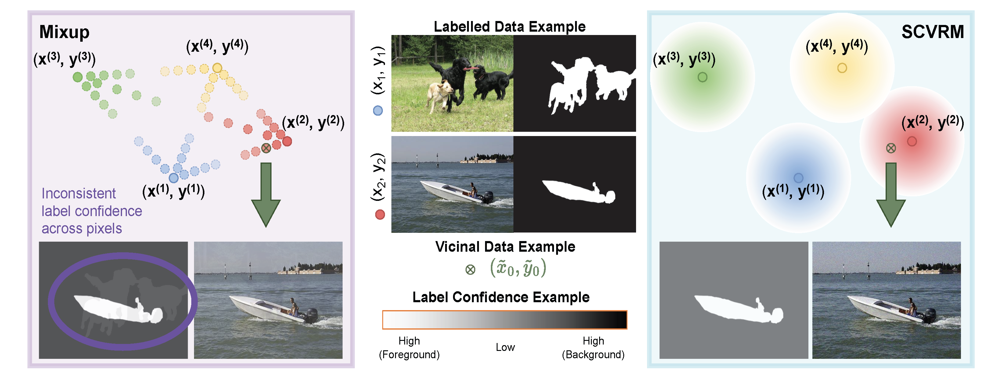

<h1 align="center"> Self-Calibrating Vicinal Risk Minimisation for Model Calibration </h1>

<p align="center">
  <a href="https://scholar.google.com.au/citations?user=gqnX0nUAAAAJ&hl=en" target="_blank">Jiawei&nbsp;Liu</a> &ensp; <b>&middot;</b> &ensp;
  <a href="https://scholar.google.com.au/citations?user=PkzMdOYAAAAJ&hl=en" target="_blank">Changkun&nbsp;Ye</a> &ensp; <b>&middot;</b> &ensp;
  <a href="https://scholar.google.com.au/citations?user=yhscu8IAAAAJ&hl=en" target="_blank">Ruikai&nbsp;Cui</a> &ensp; <b>&middot;</b> &ensp;
  <a href="https://scholar.google.com.au/citations?user=yMXs1WcAAAAJ&hl=en" target="_blank">Nick&nbsp;Barnes</a>&ensp;
</p>

<p align="center">
  Australian National University &emsp;
</p>

<p align="center">
  <a href="https://openaccess.thecvf.com/content/CVPR2024/html/Liu_Self-Calibrating_Vicinal_Risk_Minimisation_for_Model_Calibration_CVPR_2024_paper.html" target="_blank">📃 Paper</a> &ensp;
</p>

## Overview
This work addresses a fundamental machine/deep learning problem: ***model calibration - does the empirical class distribution conditioned on probabilistic model prediction matches the predicted distribution.*** We propose a ***Self-Calibrating Vicinal Risk Minimisation (SCVRM)*** that explores the vicinal data space where augmented data with increasing distance to the labelled data are assigned less confident labels. Experimental results demonstrate that SCVRM can significantly enhance model calibration for different dense classification tasks on both in-distribution and out-of-distribution data.



<!-- ## News and Updates
**[]** -->

## Environment Requirement
- python 3.8.12
- cuda 11.3
- pytorch 1.11.0
- torchvision 0.12.0

## Prepare the Data
Download the training dataset: <a target="_blank" href="https://www.kaggle.com/datasets/balraj98/duts-saliency-detection-dataset">DUTS-TR</a> and the six SOD testing datasets: <a target="_blank" href="https://www.kaggle.com/datasets/balraj98/duts-saliency-detection-dataset">DUTS-TE</a> (same link as DUTS-TR), <a target="_blank" href="http://saliencydetection.net/dut-omron/">DUT-OMRON</a>, <a target="_blank" href="http://cbi.gatech.edu/salobj/">PASCAL-S</a>, <a target="_blank" href="https://www.elderlab.yorku.ca/resources/salient-objects-dataset-sod/">SOD</a>, <a target="_blank" href="https://i.cs.hku.hk/~yzyu/research/deep_saliency.html">HKU-IS</a> and <a target="_blank" href="https://www.cse.cuhk.edu.hk/leojia/projects/hsaliency/dataset.html">ECSSD</a>. The 500 Out-of-Distribution texture images are selected from the <a target="_blank" href="https://www.robots.ox.ac.uk/~vgg/data/dtd/">Describable Texture Dataset (DTD)</a>. To extract the texture image dataset, DTD_Texture_500, run the following code after placing the DTD dataset under the "Dataset" directory:

```
python Dataset/Process_Texture_Dataset.py
```


## Train, Test and Evaluate
To train, test and evaluate the model consecutively, run the following line of code:
```
CUDA_VISIBLE_DEVICES=GOU_ID python main_SCVRM.py
```


## Pretrained Model
Pretrained model weight can be downloaded from the [<a target="_blank" href="https://drive.google.com/drive/folders/1KIJ6k-cnlCbu8Rxtrln-xbG5Qta444aw?usp=share_link">Google Drive</a>].


**The structure of dataset directory is illustrated as below:**
```
├── Dataset
│   ├── DUTS-TR-Train.txt
│   ├── DUTS-TR-Validation.txt
│   ├── Train
│   │   ├── DUTS-TR
│   │   │   ├── Image
│   │   │   ├── GT
│   ├── Test
│   │   ├── DUTS-TE
│   │   ├── DUT-OMRON
│   │   ├── PASCAL-S
│   │   ├── SOD
│   │   ├── HKU-IS
│   │   ├── ECSSD
│   │   ├── DTD_Texture_500
```
The subdirectory structure of the testing dataset follows that of the training dataset.


## <a name="bibtex">Citing SCVRM</a>

```BibTex
@InProceedings{Liu_2024_CVPR,
    author    = {Liu, Jiawei and Ye, Changkun and Cui, Ruikai and Barnes, Nick},
    title     = {Self-Calibrating Vicinal Risk Minimisation for Model Calibration},
    booktitle = {Proceedings of the IEEE/CVF Conference on Computer Vision and Pattern Recognition (CVPR)},
    month     = {June},
    year      = {2024},
    pages     = {3335-3345}
}
```